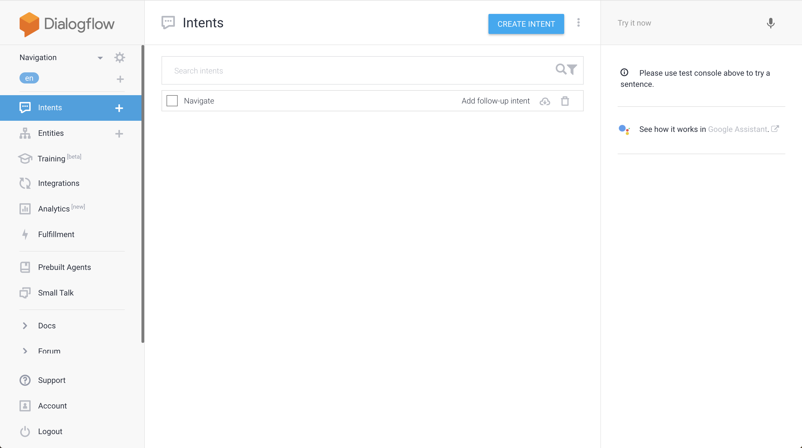
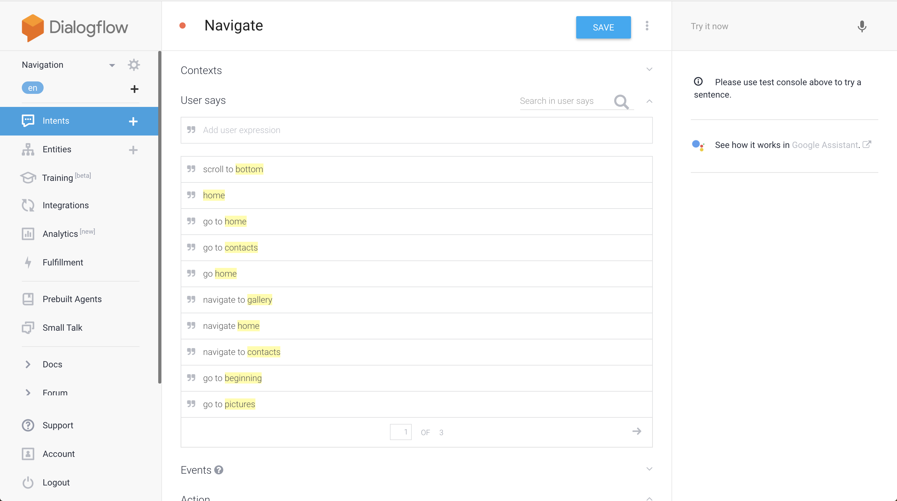
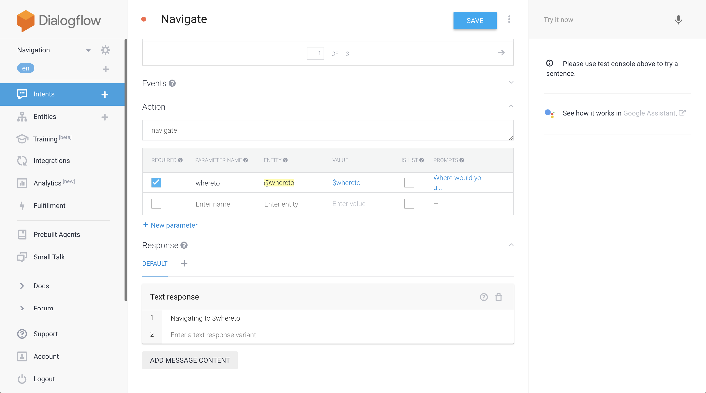
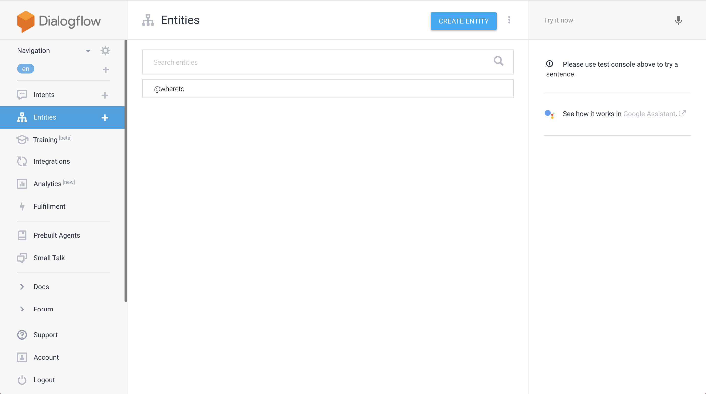
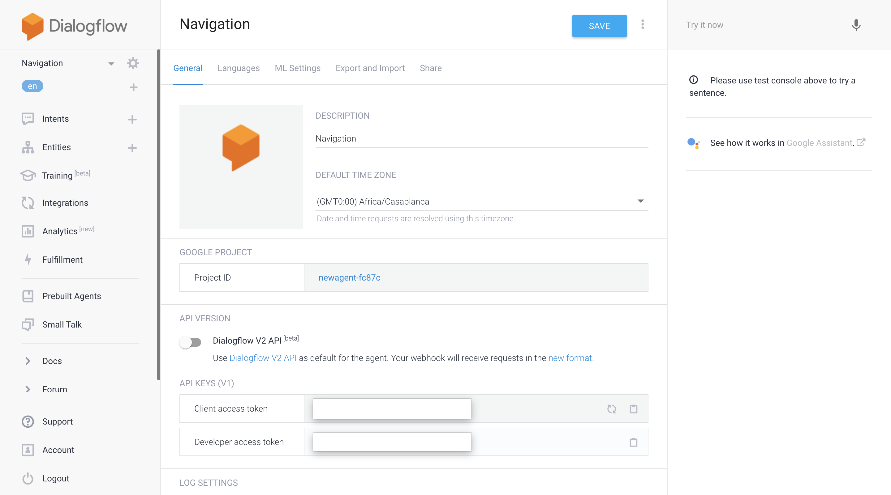
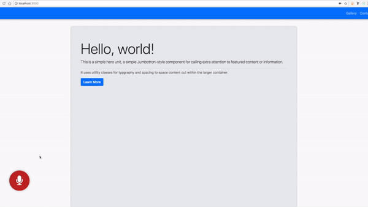

# React Audio Assistant [](https://badge.fury.io/js/react-audio-assistant) [](https://www.npmjs.org/package/react-audio-assistant)

This packages' purpose is to enable audio navigation and interaction in your website/webapp.

As Siri or Google Assistant are to the smartphone, so is this to the web.

This package is heavily dependent on [DialogFlow](https://dialogflow.com).

An option to integrate with [redux](http://redux.js.org/) is also present.

## Instructions

1. The first step in the process is to create an account at [DialogFlow](https://dialogflow.com) and configure an agent suited for your website/webapp).
2. Get the client access token for your DialogFlow app to use later in this package.
4. `yarn add react-audio-assistant` or `npm i --save react-audio-assistant`
5. Import the component and use it where you want in the page (the component is fixed positioned).

## Creating a DialogFlow Agent

Head over to [DialogFlow](https://dialogflow.com/) and create your account.

After this is done, create a new agent (which requires you to create a new project on [google console](https://www.google.com/webmasters/tools/home?hl=en) too).

Now is the time to create an Intent. Intents are the building blocks of logic for our application navigation.



Then enter in the intent details screen and configure the intent to suit your needs.
In this example case, we are using a Navigate Intent, because we want to navigate our website using our voice.





You also need an entity to identify the query you want. Create an Entity.



Enter in the entity details screen and configure your entity accordingly, training it a bit too in the process.


After all this is done, access the settings page for the project and copy the client access token, you will need it to make the requests to the platform.



## Demo Project

A demo project is available [here](https://github.com/WebPaquitos/audio-navigation-client).



A simple use case without Redux:
```javascript
import React, { Component } from 'react';
import { ReactAudioAssistant } from 'react-audio-assistant';

export default class YourComponent extends Component {
    render() {
        return (
            <div>
                <p>This is a div with my custom component stuff</p>
                <ReactAudioAssistant
                    token={YOUR_DIALOG_FLOW_TOKEN}
                    navigate={(target) => console.log(target)}/>
            </div>
        );
    }
}
```

A simple use case with Redux:
```javascript
// somewhere in your components
import React, { Component } from 'react';
import { ReactAudioAssistantWithRedux } from 'react-audio-assistant';

export default class YourComponent extends Component {
    render() {
        return (
            <div>
                <p>This is a div with my custom component stuff</p>
                <ReactAudioAssistant
                    token={YOUR_DIALOG_FLOW_TOKEN}
                    navigate={(target) => console.log(target)}/>
            </div>
        );
    }
}

// in your main reducer
import { combineReducers } from 'redux';
import { audioAssistant } from 'react-audio-assistant';

export default combineReducers({
    audioAssistant,
});
```

## License

MIT
